# Enterprise Integration Patterns

## base premises

v

I. system integration is a recurring problem;

v

II. tech varies, but the problems are similar in nature;

## unconfortable questions

v

a. why do we always reinvent the wheel?

v

b. why don't we have a standard lexicon for integration?

## unconfortable(r) answers

v

a. for no good reason whatsoever;

v

b. we do, and it's called Enterprise Integration Patterns;

## now for some definition...

v

An EIP represents a recurring element in integration

v

these elements may be endpoints, processors and channels

## hey, I love analogies! got some for me?

v

*EIPs are like Design Patterns for integration*

v

**true** because:

v

they provide a standard, platform-agnostic language

v

they can be described in terms of problems and how to solve them

v

they have become textbook material

v

**false** because:

v

they are much more platform agnostic

v

they are descriptive, not prescriptive

v

*EIPs are basically what ESBs do*

v

**true** because

v

this is really at the core of any ESB

v

ESBs and componentization have helped popularize EIPs

v

**false** because

v

not all ESBs implement all patterns

v

not all ESBs speack EIPese

v

ESB may and usually do a whole lot of additional things

## enough talk! show me the code!

v

(finally)

v

but...

v

we may not be talking about code, it's a lexicon...

## ok, then, so show me the ~~code~~ diagrams!

v

first, the basics

v

### Message
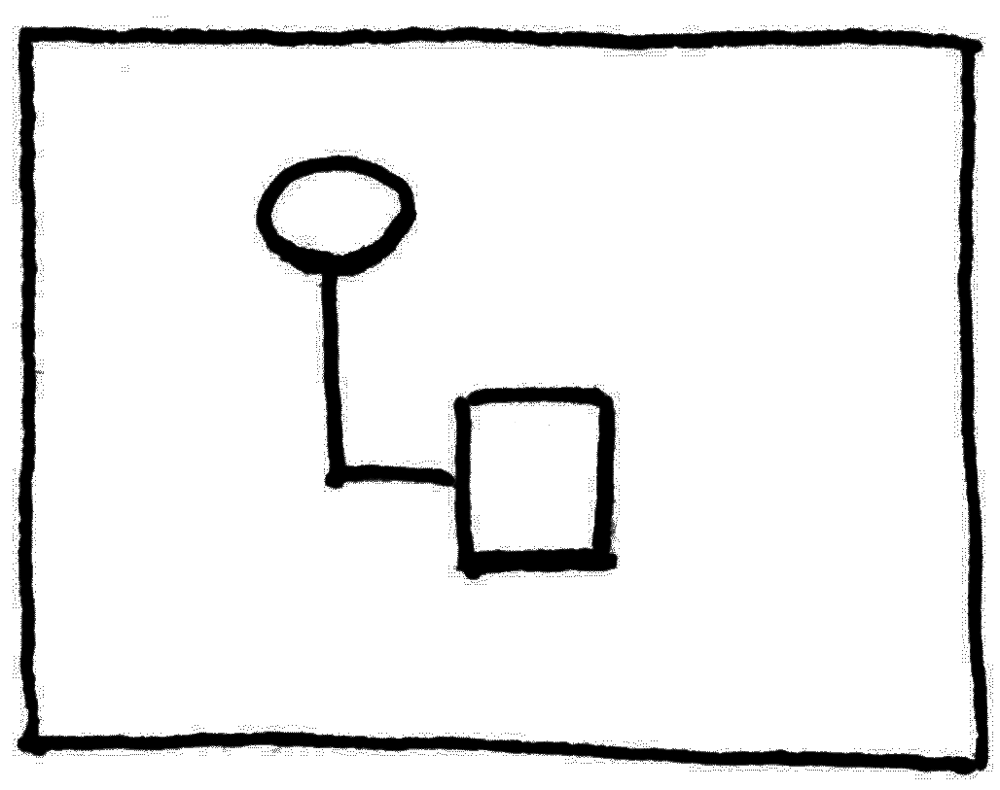</img>

v

### Endpoint
</img>

v

### Channel
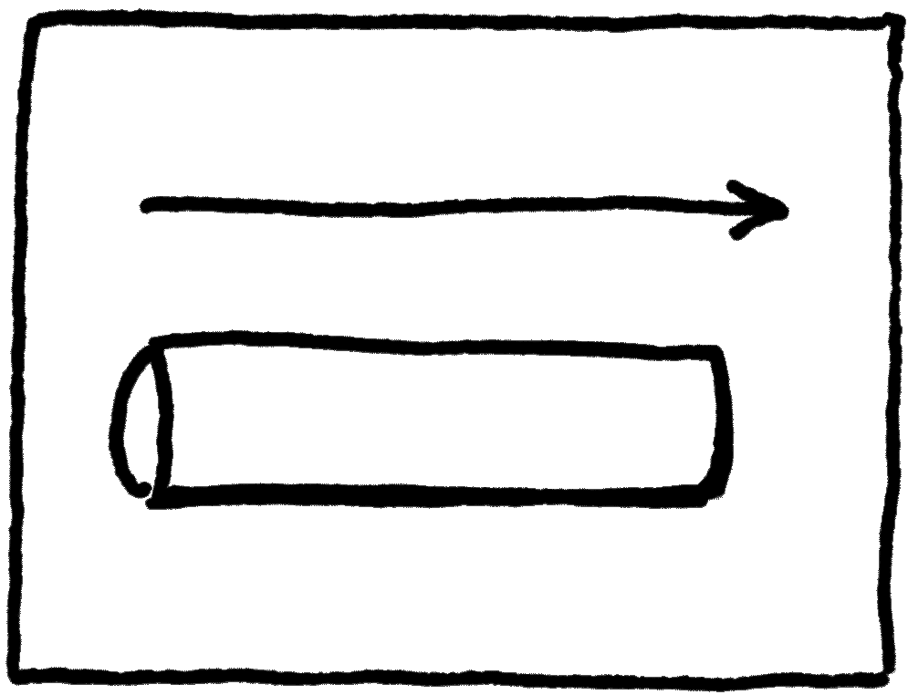</img>

v

### Publish/Subscribe Channel
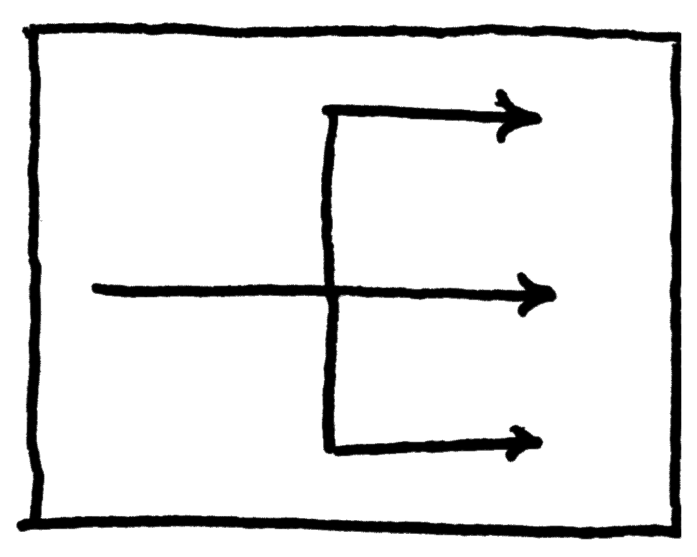</img>

v

## Example \#01:
1. read incoming files from an FTP
2. pass through a queue
3. pass it to a file share

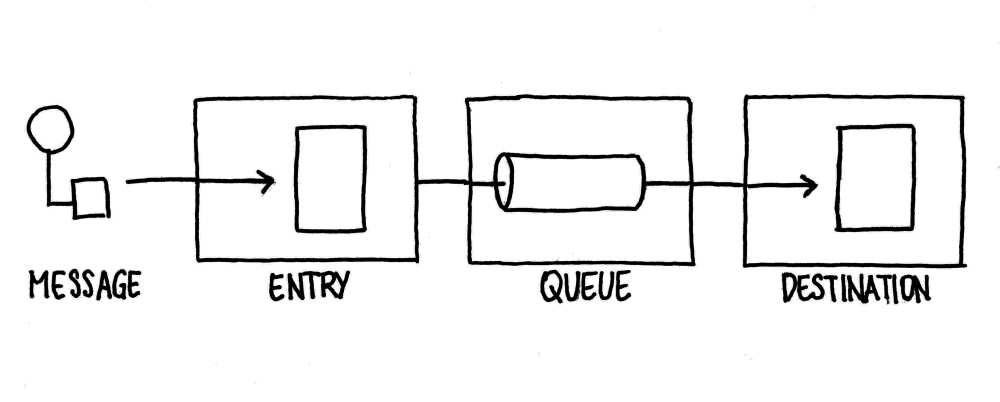</img>

v

## Example \#02:
1. read incoming files from a REST service
2. pass through a queue
3. pass it to staging table within a DB

</img>

v

*wait! please go back to the first example*

v

## Example \#01:
1. read incoming files from an FTP
2. pass through a queue
3. pass it to a file share

</img>

v

*now the second...*

v

## Example \#02:
1. read incoming files from a REST service
2. pass through a queue
3. pass it to staging table within a DB

</img>

v

*a-ha! the diagrams are the same! copy-and-paste mistake!*

v

not this time, little grasshopper

v

the diagrams are the same because the scenarios require the same **patterns**

## popular message processors

v

### Translator
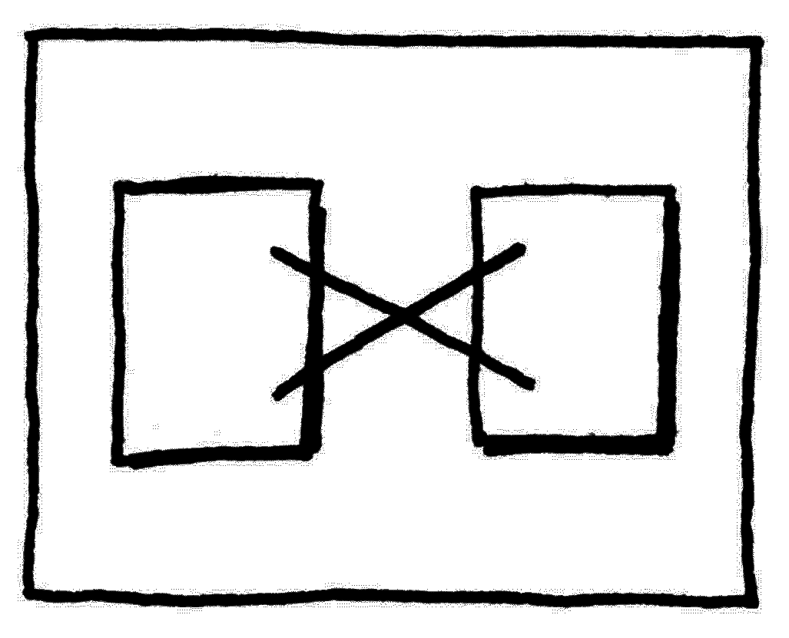</img>

v

### Content-based router
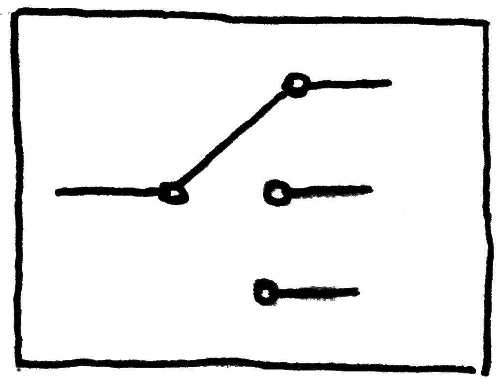</img>

v

### Splitter
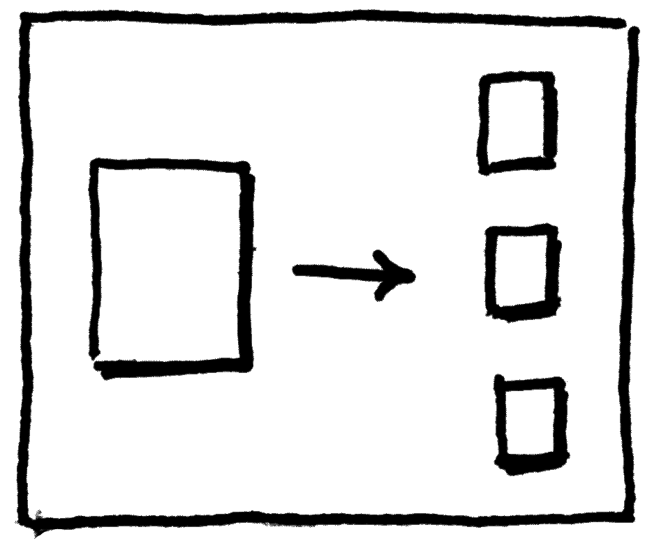</img>

v

### Aggregator
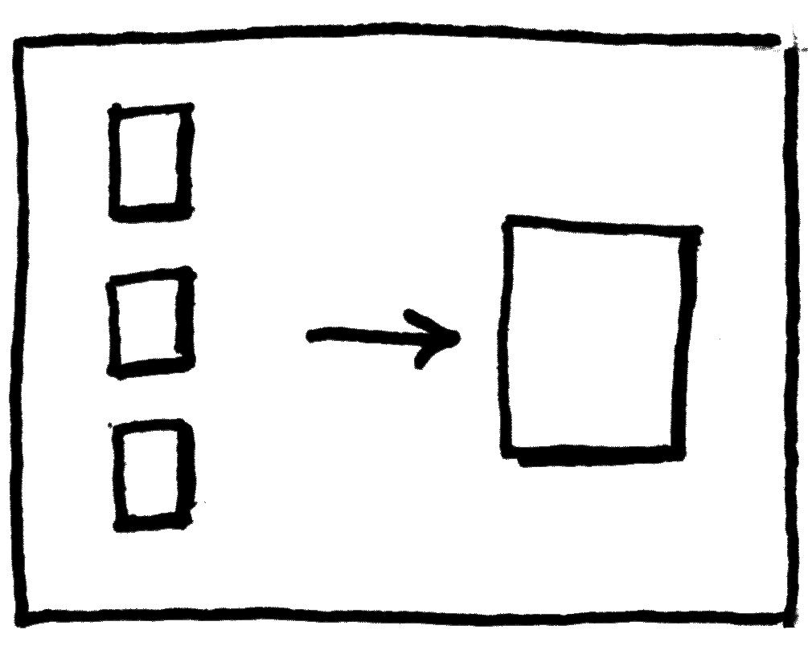</img>

v

### Enricher
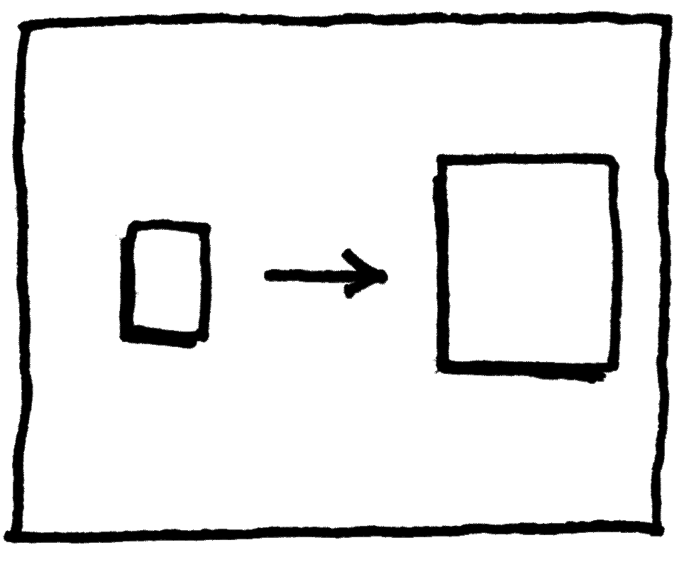</img>

v

### Content filter
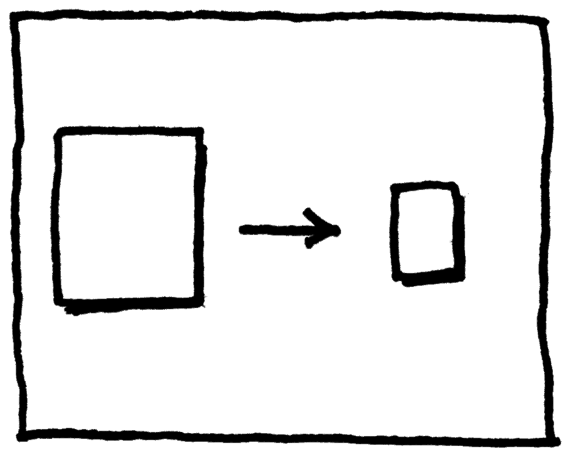</img>

v

### Filter
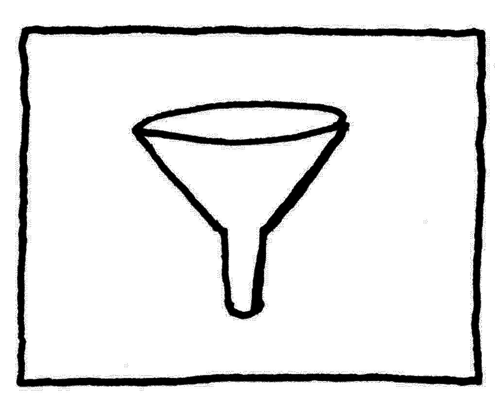</img>

## popular message patterns

v

### Event message
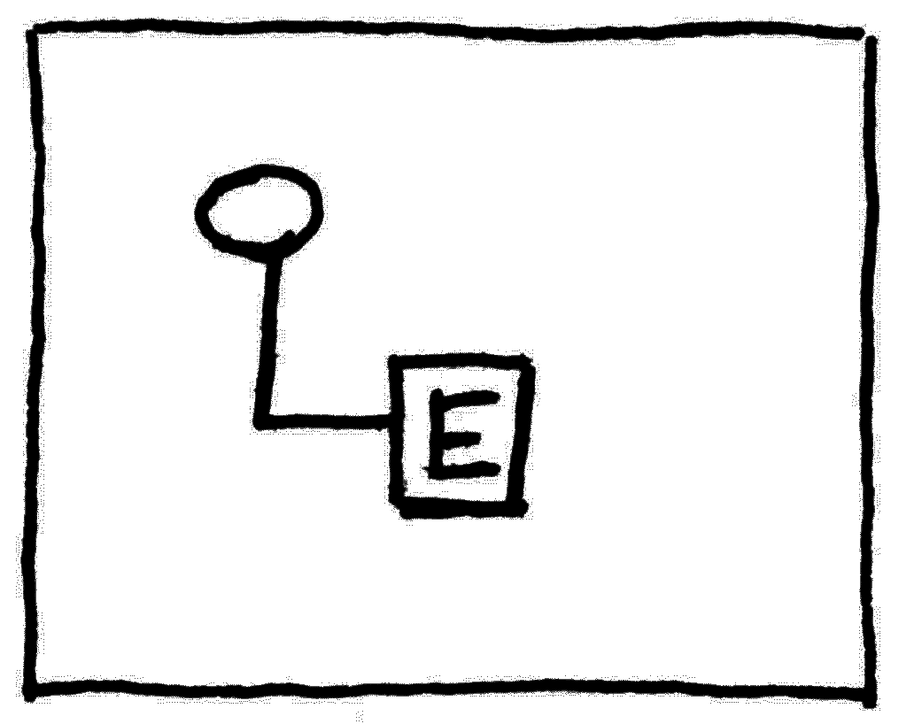</img>

v

### Command message
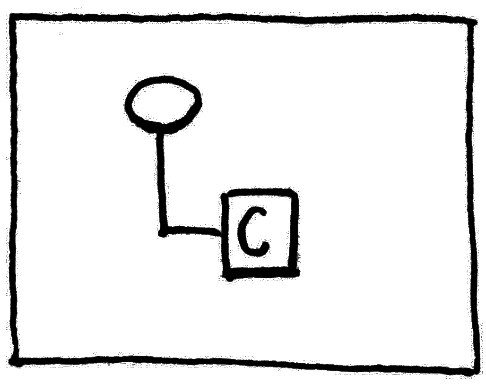</img>

# now let's do some whiteboarding...
(demo)

v

(nothing to see here, we are whiteboarding...)

# tks

# References
[The book](http://amzn.com/0321200683)

[Reference web site](http://www.eaipatterns.com)

[Presentation engine](https://github.com/hakimel/reveal.js)

[license]: https://i.creativecommons.org/l/by/4.0/88x31.png